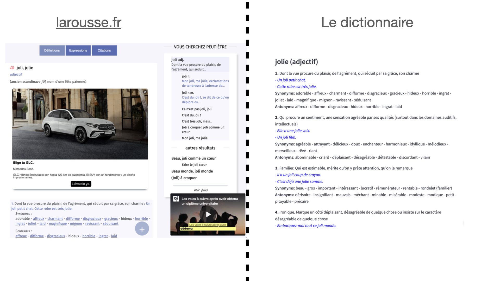

# Dictionnaire Français
Un site web pour chercher la definition de mots en français.
(For the english explanation, check [below](#french-dictionary))

## Raison d'être 
En tant qu'étudiant français, j'ai eu beaucoup de mal à consulter le site Internet de Larousse pour trouver les définitions de mots. Le site est rempli de publicités très ennuyeuses, ce qui rend très difficile de se concentrer sur la définition. Je voulais créer une interface pour obtenir les définitions dans une visualisation plus claire.

Comparez, l'avant et l'après:

## Moteur de recherche personnalisé
[Ici](https://support.google.com/chrome/answer/95426?hl=fr&co=GENIE.Platform%3DDesktop#zippy=%2Cchamp-url-avec-s-%C3%A0-la-place-de-la-requ%C3%AAte) les instructions pour l'utiliser comme moteur de recherche personnalisé avec chrome.

URL: https://ledictionnaire.streamlit.app/?mot=%s

### Autor 
Ulises Rey

# French Dictionary
A website to show definition of french words, based on Larousse.

## Motivation 
As a french student I had a very hard time looking at the Larousse website for word definitions. The website is crazy packed with very annoying adds, which make it very hard to focus on the definition. I wanted to create an interface to get the definitions in a cleaner visualization.

Compare, before and after:

## Custom Search with Le Dictionnaire
Follow this instructions to use Le Dictionnaire as a custom search engine, for faster usage. [Chrome](https://zapier.com/blog/add-search-engine-to-chrome/) and [Firefox](https://superuser.com/questions/7327/how-to-add-a-custom-search-engine-to-firefox)

URL: https://ledictionnaire.streamlit.app/?mot=%s
### Author 
Ulises Rey

